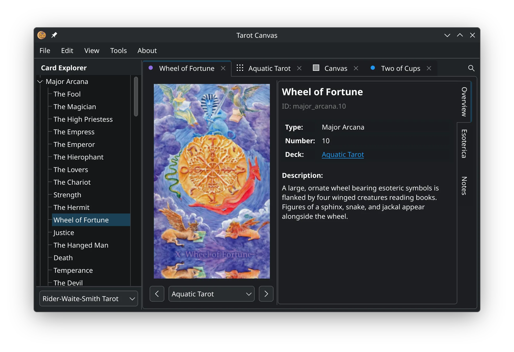

# Tarot Canvas

A digital home for your personal tarot collection on Linux.



## Features

- Explore tarot deck imagery, metadata and esoterica.</li>
- Place and arrange tarot cards from any deck on a virtual canvas.</li>
- Create and add your own decks by following a standard [tarot deck format](./docs/FAQs.md).


## Installation

The preferred installation method is via Flatpak from Flathub:

<a href='https://flathub.org/en/apps/land.arcana.TarotCanvas'></a>

```bash
flatpak install flathub land.arcana.TarotCanvas
```


### From Source

Requires `just` and `flatpak`.

```
just flatpak deps
just flatpak install
flatpak run land.arcana.TarotCanvas
```

